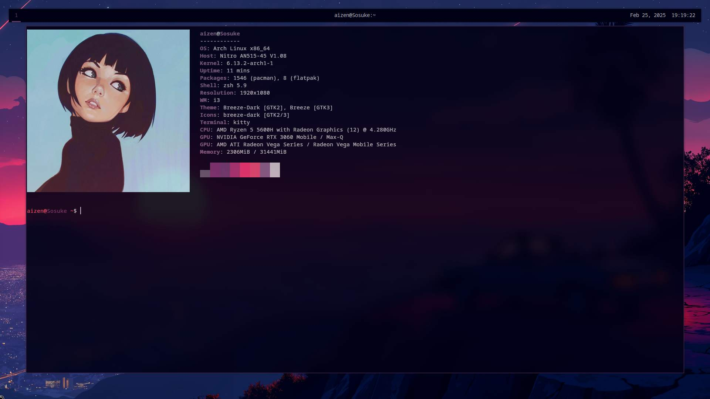

# Linux Dotfiles & Ricing Setup

Welcome to my Linux dotfiles repository! This collection of configuration files and scripts will help you transform your desktop into a streamlined and professional environment.

## Overview

This repository contains configurations for various tools and applications used in my Linux setup, including window managers, status bars, and terminal settings. Follow the instructions below to copy the files, install the required packages, and integrate these configurations into your system.

## Installation

### 1. Clone the Repository

First, clone this repository to your local machine:

```bash
git clone https://github.com/yourusername/dotfiles.git
cd dotfiles


## Screenshots



